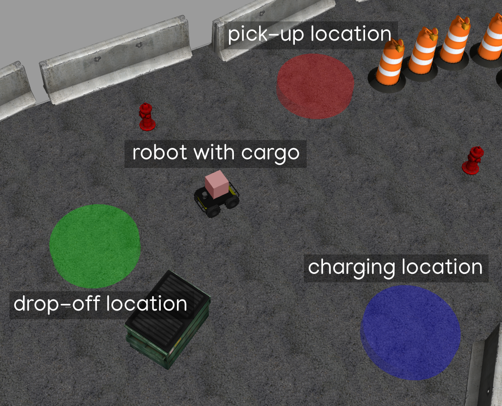

# temoto_umrf_demos
This is a setup package for replicating the ROS + husky simulation-based demonstrations presented the journal paper *"Unified Meaning Representation Format (UMRF) - A Task Description and Execution Formalism for HRI"*

# Installation
```bash
cd <your-catkin-workspace>/src
git clone --recursive https://github.com/temoto-telerobotics-demos/temoto_umrf_demos
cd ..
catkin build
source devel/setup.bash
```
# Install dependencies
```bash
cd ~/<your-catkin-workspace>
rosdep install --from-paths src --ignore-src -r -y

# For ROS Noetic, point the python interpreter to your default python3 with this package:
sudo apt install python-is-python3
```

# Test if the robot simulation is properly set up

Open a terminal and launch the sim_driver:
```bash 
roslaunch robot_temoto_config husky_sim_driver.launch
```
You should see the Gazebo sim opening up. If you are launching it for the first time, then
it might take some time for Gazebo to download the world models. Once the world is loaded, you 
should see the robot. There might be couple of warnings in the terminal about `No p gain specified for pid` 
or `Failed to meet update rate!` but that's nothing to worry about.


Next, open a second terminal and launch the controller:
```bash
roslaunch robot_temoto_config husky_sim_controller.launch 
```
Again, there might initially be couple of warnings about `Timed out waiting for transform from base_link to map` 
and `Parameter max_trans_vel is deprecated`. If any warning is periodically reported, then something is probably not right.


Finally, open a third terminal and launch the visualization:
```bash
roslaunch robot_temoto_config husky_sim_viz.launch
```
RViz should pop up and you should see the map, robot and lidar data. Use the `2D Nav Goal` tool to move the robot 
somewhere within the map. If the robot performs sucessfully, then the simulation is set up properly.

# Sequential and cyclical navigation actions example

This example shows UMRF notation can be used to define tasks that contain sequences and/or cycles. The underlying task in this example is to navigate through predefined waypoints, as shown below:

<p align="center">
  
</p>

A [navigation action](https://github.com/temoto-telerobotics-demos/temoto_umrf_demos/tree/main/robot_temoto_config/temoto_actions/ta_navigate_robot) is used as the basis of the examples. The navigation action accepts navigation coordinates via UMRF input parameters:

```json
"name": "TaNavigateRobot",
"effect": "synchronous",
"input_parameters": {
    "robot_name": {
        "pvf_type": "string"
    },
    "nav_goal": {
        "x": {
            "pvf_type": "number"
        },
        "y": {
            "pvf_type": "number"
        },
        "yaw": {
            "pvf_type": "number"
        }
    }
}
```

By combining such UMRF descriptions in the UMRF graph via parent/child relations, more complex behaviours can be achieved, including [sequences](https://github.com/temoto-telerobotics-demos/temoto_umrf_demos/blob/main/robot_temoto_config/umrf_graphs/navigation_demo_sequence.umrfg.json) and [cycles](https://github.com/temoto-telerobotics-demos/temoto_umrf_demos/blob/main/robot_temoto_config/umrf_graphs/navigation_demo_cycle.umrfg.json):

<p align="center">
  
</p>

## Running the demo

First run TeMoto:
```bash
roslaunch robot_temoto_config temoto.launch
```

Open another terminal and go to the umrf graphs directory
```bash
roscd robot_temoto_config/../umrf_graphs
```

Invoke the UMRF graph that initializes the robot:
```bash
rosrun temoto_action_engine parser_node initialize_robot.umrfg.json my_temoto
```

Invoke the UMRF graph that starts the sequential waypoint navigation:
```bash
rosrun temoto_action_engine parser_node navigation_example_sequence.umrfg.json my_temoto
```

The robot should navigate through three waypoints and stop. Next invoke the UMRF graph that starts the cyclical waypoint navigation:
```bash
rosrun temoto_action_engine parser_node navigation_example_cycle.umrfg.json my_temoto
```

In order to stop the cyclical waypoint navigation graph, run:
```bash
rostopic pub /broadcast_stop_umrf_graph temoto_action_engine/BroadcastStopUmrfGraph "graph_name: 'navigation_example_cycle'
targets:
- 'my_temoto'"
```

# Cargo delivery state machine example

This example shows how UMRF graph can describe a state machine based automation. The underlying task in this example is to transport "cargo" from a pick-up location to drop-off location. Additionally the robot has a simulated battery which must be charged whenever it discharges below a predefined threshold. Thus there are six states in the state machine, with following possible transitions:

<p align="center">
  
</p>

* **Initialize** - Loads the simulated robot and places markers of the charging, pick-up and drop-off locations into the simulated world. The ROS-based robot also contains a ROS node that simulates a continuously discharging battery, which can be set to charge via a ROS service. The feedback on battery's state is provided via `sensor_msgs::BatteryState` ROS message. 
* **Navigate** - Makes the robot navigate to the desired goal loacation provided via UMRF parameters. The navigation is performed via [TeMoto Robot Manager](https://github.com/temoto-telerobotics/temoto_robot_manager).
* **Pick-up** - Spawning a box on top of the simulated robot.
* **Drop-off** - Deletes the spawned box.
* **Charge** - Charges the simulated battery by invoking the charging ROS service in the battery manager node.
* **Dispatch** - Decides how the *navigation*, *pick-up*, *drop-off* and *charging* states should be sequenced. Each of the aforementioned four states accept a UMRF parameter named `state` and via `pvf_allowed_values` the transition to a specific state, e.g., *navigate*, happens only if the right state name is used. For example if the *dispatch* state outputs `state=navigate`, then out of the four possible transitions, only the *navigation* state is invoked.

Screenshot of the simulated world with the charging, pick-up, drop-off locations and the robot:
<p align="center">
  
</p>

## Running the demo

First run TeMoto:
```bash
roslaunch robot_temoto_config temoto.launch
```

Open another terminal and go to the umrf graphs directory
```bash
roscd robot_temoto_config/../umrf_graphs
```

Invoke the UMRF graph that embeds the cargo delivery task:
```bash
rosrun temoto_action_engine parser_node cargo_delivery.umrfg.json my_temoto
```

In order to stop the cargo delivery task, run:
```bash
rostopic pub /broadcast_stop_umrf_graph temoto_action_engine/BroadcastStopUmrfGraph "graph_name: 'cargo_delivery'
targets:
- 'my_temoto'"
```